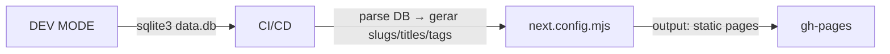

# 📝 Blog Tech — Blog Estático com Dev Mode + GitHub Pages

> Um blog de tecnologia moderno, profissional e pessoal, com modo de desenvolvimento via CLI (TUI), persistência SQLite simples, SSG via GitHub Actions, UI moderna com tema escuro e tags de filtro.

---

## ✨ Destaques
- **Dev Mode**: Crie posts diretamente no terminal (TUI) — sem precisar abrir o navegador!
- **Persistência**: SQLite local (`db.sqlite`) para simplicidade e velocidade
- **SSG Automático**: GitHub Actions gera páginas estáticas a cada push → deploy automático via GitHub Pages
- **UI Moderna**: Tema dark/claro, design minimalista, tags coloridas por categoria, layout responsivo
- **Filtros Avançados**: Filtre posts por tags (ex: "C#", "Legacy", "Migração")

---

## 🚀 Começando Rápido — 5 minutos para rodar o Dev Mode

```bash
# 1. Clonar e instalar dependências
git clone https://github.com/your-repo/blog-tech.git
cd blog-tech
npm install
```

```bash
# 2. Iniciar o servidor de desenvolvimento
npm run dev
```

```bash
# 3. Abrir o terminal e criar seu primeiro post!
# (A TUI do Dev Mode aparecerá — siga as instruções na tela)
```

---

## 🛠️ Stack Tecnológica
| Camada | Tecnologia |
|--------|------------|
| **Frontend/SSG** | Next.js 14+ (App Router), React 19, TailwindCSS |
| **Dev Mode CLI** | TUI em terminal (react-terminal ou readline simples) |
| **Persistência Dev** | SQLite (single-file DB para simplicidade) |
| **CI/CD** | GitHub Actions → parse SQLite → gerar páginas estáticas → commitar ao branch `gh-pages` |
| **UI** | Tema claro/escuro, design minimalista e acessível |

---

## 📁 Estrutura do Projeto
```
static-blog/
├── .github/workflows/          # GitHub Actions (build-and-deploy.yml)
├── public/                   # Assets estáticos (logo, favicon, etc.)
├── src/                      # Código-fonte do projeto
│   ├── app/                  # App Router (Next.js 14+)
│   │   ├── posts/            # Listagem e filtros por tag
│   │   ├── new-post/         # Formulário de criação de post
│   │   └── layout.tsx        # Layout principal com tema dark/claro
│   ├── components/          # Componentes reutilizáveis (Card, TagSelect, etc.)
│   ├── lib/                 # Utilitários e DAOs (CRUD SQLite)
│   └── scripts/             # Scripts de build estático (Node.js)
├── db.sqlite                # Banco de dados local (commitado no repositório)
├── agents.md               # Plano de implementação sequencial
├── ARCHITECTURE.md         # Documentação técnica e decisões de design
└── README.md              # Este arquivo!
```

---

## 📋 Fluxo de Trabalho — Do Dev Mode ao GitHub Pages



1. **Dev Mode**: Você cria posts via TUI no terminal (cria registros no `db.sqlite`)
2. **CI/CD**: GitHub Actions lê o SQLite, gera HTML estático para cada post
3. **GitHub Pages**: O branch `gh-pages` é publicado automaticamente → acessível via URL pública

---

## 🧪 Testando o Dev Mode — Criar um Post de Exemplo

```bash
# 1. Iniciar servidor (se ainda não rodou)
npm run dev
```

```bash
# 2. Abrir terminal e criar post:
#    - Título: "Migração de Código Legacy para Moderno"
#    - Slug: "2026-05-23-migracao-codigo-legado"
#    - Tags: ["C#", "Legacy", "Migração"]
```

```bash
# 3. Verificar no navegador (http://localhost:3000/posts)
#    → O novo post aparece na lista!
```

---

## 🎨 Tema Dark/Claro — Alternar com um Clique

- **Padrão**: Dark mode ativado por padrão (ou conforme preferência do sistema via `prefers-color-scheme`)
- **Alternar manualmente**: Clique no botão de toggle no header da página
- **Persistência**: A escolha é salva em `localStorage` → o tema persiste ao recarregar a página

---

## 🏷️ Filtros por Tag — Como Funciona

1. Navegue para `/posts`
2. Use o dropdown de tags no filtro superior
3. Selecione uma ou mais tags (ex: "C#" + "Legacy")
4. Apenas os posts marcados com essas tags aparecem na lista
5. Clique em "Limpar Filtros" para mostrar todos os posts novamente

---

## 📦 Scripts Disponíveis
| Comando | Descrição |
|--------|-----------|
| `npm run dev` | Inicia servidor de desenvolvimento (Hot Reload) |
| `npm run build:static` | Gera páginas estáticas a partir do SQLite local |
| `npm run audit:checklist` | Executa checklist de auditoria de código |

---

## 🤝 Contribuindo — Quer ajudar no projeto?

1. Fork o repositório
2. Crie uma branch (`git checkout -b feature/nome-da-sua-feature`)
3. Faça commits com mensagens claras e descritivas
4. Envie um Pull Request para revisão

---

## 📜 Licença
Este projeto está sob a licença MIT — veja o arquivo `LICENSE` para detalhes.

---

<div align="center">
  <strong>Feito com ❤️ usando Next.js + SQLite + GitHub Actions</strong>
</div>